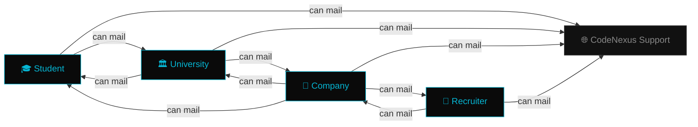

<div align="center">

# 🌌 &lt;cn/&gt; CodeNexus

### THE COMPLETE CAMPUS PLACEMENT ECOSYSTEM

<p align="center">
  
  
  
  
  
</p>

<p>
  <code>bg-[#050505]</code> · <code>accent: oklch(0.777 0.152 181.912)</code> · <code>font: JetBrains Mono</code>
</p>

</div>

---

## 🚀 Overview

**CodeNexus** is a closed-loop campus placement platform that eliminates the need for any external communication tools. It connects four stakeholders — **Students**, **Universities**, **Companies**, and **Recruiters** — through dedicated, role-based dashboards, an internal mailing system, live webinar rooms, a competitive coding arena, and a real-time interview IDE.

Every interaction — from scheduling a pre-placement talk to conducting a live technical interview — happens entirely within CodeNexus.

---

## 🏗️ Platform Architecture

```mermaid
graph TB
    subgraph "🌐 Public"
        A["/ Landing Page"] --> B["/login"]
        A --> C["/signup"]
    end

    subgraph "🎓 Student Portal"
        D["/student/dashboard"]
        E["/student/codearena"]
        F["/student/codearena/:id"]
        G["/student/interview"]
        H["/student/webinars"]
        I["/student/webinar"]
        J["/student/mail"]
    end

    subgraph "🏛️ University Portal"
        K["/university/dashboard"]
        L["/university/webinars"]
        M["/university/evaluation"]
        N["/university/mail"]
    end

    subgraph "🏢 Company Portal"
        O["/company/dashboard"]
        P["/company/create-contest"]
        Q["/company/evaluation"]
        R["/company/ppt"]
        S["/company/webinar"]
        T["/company/mail"]
    end

    subgraph "👔 Recruiter Portal"
        U["/recruiter/dashboard"]
        V["/recruiter/interview"]
        W["/recruiter/mail"]
    end

    B --> D & K & O & U
    C --> D & K & O & U

    style A fill:#0a0a0a,stroke:#333,color:#fff
    style D fill:#0a0a0a,stroke:#06b6d4,color:#06b6d4
    style K fill:#0a0a0a,stroke:#06b6d4,color:#06b6d4
    style O fill:#0a0a0a,stroke:#06b6d4,color:#06b6d4
    style U fill:#0a0a0a,stroke:#06b6d4,color:#06b6d4
```



---

## ✨ Features by Role

### 🎓 Student Portal

| Feature | Route | Description |
|---------|-------|-------------|
| **Command Center** | `/student/dashboard` | Personalized analytics, placement drive status, quick-access widgets, and progress tracking. |
| **Code Arena** | `/student/codearena` | Competitive programming hub with curated problem sets, difficulty filters, and leaderboard rankings. |
| **Problem Solver** | `/student/codearena/:id` | Full-screen IDE with syntax highlighting, multi-language support, real-time test-case execution, and submission tracking. |
| **Interview Room** | `/student/interview` | Three-column live interview IDE — problem description, code editor, and integrated video/chat panel. |
| **Webinar List** | `/student/webinars` | Browse scheduled pre-placement talks by companies. Join button activates 5 minutes before the scheduled time. |
| **Webinar Room** | `/student/webinar` | Live webinar participation with chat, screen sharing view, raise hand, and participant list. Mic/camera are host-controlled. |
| **Internal Mail** | `/student/mail` | Send messages to university placement cell or CodeNexus support using unique CodeNexus IDs. Inbox + Sent + Compose. |

---

### 🏛️ University Placement Cell

| Feature | Route | Description |
|---------|-------|-------------|
| **Command Center** | `/university/dashboard` | Manage placement drives, view student pools, track company partnerships, and monitor drive analytics. |
| **Webinar List** | `/university/webinars` | View and manage scheduled company webinars targeting the university's students. |
| **Evaluations** | `/university/evaluation` | Review student performance across interviews and contests with detailed assessment reports. |
| **Internal Mail** | `/university/mail` | Communicate with students, companies, and CodeNexus support. No external email required. |

---

### 🏢 Company Portal

| Feature | Route | Description |
|---------|-------|-------------|
| **Command Center** | `/company/dashboard` | Overview of partner universities, candidate pipelines, active drives, and recruitment analytics. |
| **Create Contest** | `/company/create-contest` | Design custom coding assessments with problem sets, time limits, and target university selection. |
| **Schedule PPT** | `/company/ppt` | Schedule pre-placement talk webinars — set date, time, duration, target universities, and agenda. |
| **Webinar Room** | `/company/webinar` | Host live webinars with screen sharing, chat, participant management, and mic/camera controls. |
| **Evaluations** | `/company/evaluation` | Review interview recordings, candidate reports, and make Select/Reject decisions with evaluator notes. |
| **Internal Mail** | `/company/mail` | Message universities, students, recruiters, and CodeNexus support using internal IDs. |

---

### 👔 Recruiter Portal

| Feature | Route | Description |
|---------|-------|-------------|
| **Command Center** | `/recruiter/dashboard` | View upcoming interviews, past recordings with ratings/verdicts, candidate profiles with projects and academics. |
| **Interview Room** | `/recruiter/interview` | Conduct live technical interviews within the three-column IDE — observe, evaluate, and interact in real-time. |
| **Internal Mail** | `/recruiter/mail` | Contact companies directly through internal messaging. |

---

## 📬 Internal Mailing System

CodeNexus features a fully enclosed mailing system that replaces external email entirely. Communication is restricted by role to maintain professional boundaries:



> **Key:** Students **cannot** directly contact companies or recruiters. Recruiters can **only** mail companies. All entities can reach CodeNexus support.

Each mail endpoint provides:
- 📥 **Inbox** — Received messages with modal detail view
- 📤 **Sent** — Outgoing message history
- ✏️ **Compose** — Send using the recipient's unique CodeNexus ID

---

## 💻 Live Interview IDE

The interview workspace is a purpose-built, three-column environment for conducting real-time technical interviews:

```
┌─────────────────┬─────────────────────────┬──────────────────┐
│                 │                         │                  │
│  📋 PROBLEM     │  ⌨️  CODE EDITOR         │  📹 VIDEO CHAT   │
│  DESCRIPTION    │                         │                  │
│                 │  • Multi-language        │  • HD WebRTC     │
│  • Statement    │  • Syntax highlighting   │  • Text chat     │
│  • Constraints  │  • Real-time execution   │  • Screen share  │
│  • Test Cases   │  • Test case feedback    │  • Whiteboard    │
│  • Expected I/O │  • Tab management        │  • Controls      │
│                 │                         │                  │
└─────────────────┴─────────────────────────┴──────────────────┘
```

Both `/student/interview` and `/recruiter/interview` share this unified `InterviewRoom` component with role-specific permissions.

---

## 🎨 Design System

CodeNexus follows a dark, premium, developer-centric design language:

| Token | Value | Usage |
|-------|-------|-------|
| `--color-bg-primary` | `#050505` | Root background, deep space aesthetic |
| `--color-accent-400` | `oklch(0.85 0.152 181.912)` | Hover states, highlights |
| `--color-accent-500` | `oklch(0.777 0.152 181.912)` | Primary CTA, active borders, neon cyan signature |
| `--color-accent-600` | `oklch(0.65 0.152 181.912)` | Pressed states, subtle accents |
| `--font-mono` | `JetBrains Mono` | Code, labels, navigation, data |
| `--font-sans` | `Inter, Space Grotesk` | Headings, body text, cards |
| `--font-serif` | `Georgia` | Brand logo, italicized accents |

**Signature elements:**
- 🔲 **Dotted background** — Cyan radial-gradient dots at `24px` spacing with fade mask
- 🌊 **Glassmorphism** — `backdrop-blur-md` on headers, modals, and overlays
- ✨ **Micro-animations** — Framer Motion powers sidebar transitions, tab switches, modal entrances, and hover effects
- 🎯 **Active states** — Left-border accent highlights on sidebar items with monospaced uppercase labels

---

## 🛠️ Tech Stack

| Layer | Technology | Version |
|-------|-----------|---------|
| **Framework** | React | 19 |
| **Language** | TypeScript | 5.9 |
| **Styling** | Tailwind CSS | 4.2 |
| **Routing** | React Router | 7.13 |
| **Animations** | Framer Motion | 12.36 |
| **Icons** | Lucide React | 0.577 |
| **Build Tool** | Vite | 8.0 |
| **Utilities** | clsx, tailwind-merge | latest |

---

## ⚙️ Getting Started

### Prerequisites
- [Node.js](https://nodejs.org/) v18+
- npm or yarn

### Quick Start

```bash
# Clone the repository
git clone https://github.com/DevanshBehl/codenexusfrontend.git
cd codenexusfrontend

# Install dependencies
npm install

# Start development server
npm run dev
```

The app will be live at **`http://localhost:5173`**

### Production Build

```bash
npm run build
npm run preview
```

---

## 📂 Project Structure

```
codenexusfrontend/
├── public/
├── src/
│   ├── components/
│   │   ├── CodeArena/              # Code arena shared components
│   │   ├── Interview/
│   │   │   ├── InterviewRoom.tsx   # Core 3-column interview IDE
│   │   │   ├── InterviewEditor.tsx # Code editor panel
│   │   │   ├── InterviewProblem.tsx# Problem description panel
│   │   │   ├── InterviewVideoChat.tsx # Video & chat panel
│   │   │   └── Whiteboard.tsx      # Collaborative whiteboard
│   │   └── Landing/
│   │       ├── Hero.tsx            # Animated hero section
│   │       ├── Navbar.tsx          # Navigation bar
│   │       ├── FeaturesTabs.tsx    # Interactive feature showcase
│   │       ├── DetailedFeatures.tsx# In-depth feature cards
│   │       ├── UnderTheHood.tsx    # Tech stack presentation
│   │       ├── Marquee.tsx         # Scrolling ticker
│   │       └── FinalCTA.tsx        # Call-to-action footer
│   ├── pages/
│   │   ├── student/
│   │   │   ├── Dashboard.tsx       # Student command center
│   │   │   ├── CodeArena.tsx       # Problem listing & arena
│   │   │   ├── CodeArenaProblem.tsx# Individual problem IDE
│   │   │   └── StudentInterview.tsx# Student interview wrapper
│   │   ├── university/
│   │   │   ├── Dashboard.tsx       # University placement cell
│   │   │   └── Evaluation.tsx      # Student evaluation system
│   │   ├── company/
│   │   │   ├── Dashboard.tsx       # Company recruiter hub
│   │   │   ├── CreateContest.tsx   # Contest builder
│   │   │   ├── Evaluation.tsx      # Candidate evaluation portal
│   │   │   └── SchedulePPT.tsx     # Webinar scheduler
│   │   ├── recruiter/
│   │   │   ├── Dashboard.tsx       # Recruiter command center
│   │   │   └── RecruiterInterview.tsx # Recruiter interview wrapper
│   │   ├── shared/
│   │   │   ├── WebinarList.tsx     # Role-aware webinar listing
│   │   │   └── WebinarRoom.tsx     # Live webinar environment
│   │   ├── mail/
│   │   │   └── Mail.tsx            # Universal mailing system
│   │   ├── Landing.tsx             # Landing page
│   │   ├── Login.tsx               # Authentication
│   │   ├── Signup.tsx              # Registration
│   │   └── Interview.tsx           # Interview page wrapper
│   ├── App.tsx                     # Route definitions
│   ├── App.css                     # Global styles
│   ├── index.css                   # Tailwind theme & design tokens
│   └── main.tsx                    # React DOM entry
├── index.html
├── package.json
├── vite.config.ts
├── tsconfig.json
└── eslint.config.js
```

---

## 🗺️ Complete Route Map

```mermaid
graph TD
    subgraph "Authentication"
        Landing["/"]
        Login["/login"]
        Signup["/signup"]
    end

    subgraph "Student Routes"
        SD["/student/dashboard<br/>📊 Analytics & Overview"]
        SCA["/student/codearena<br/>⚔️ Problem Listing"]
        SCAP["/student/codearena/:id<br/>💻 Problem IDE"]
        SI["/student/interview<br/>🎥 Live Interview"]
        SW["/student/webinars<br/>📺 Webinar Schedule"]
        SWR["/student/webinar<br/>🔴 Live Webinar"]
        SM["/student/mail<br/>📬 Internal Mail"]
    end

    subgraph "University Routes"
        UD["/university/dashboard<br/>🏛️ Placement Cell"]
        UW["/university/webinars<br/>📺 Webinar List"]
        UE["/university/evaluation<br/>📝 Assess Students"]
        UM["/university/mail<br/>📬 Internal Mail"]
    end

    subgraph "Company Routes"
        CD["/company/dashboard<br/>🏢 Recruiter Hub"]
        CC["/company/create-contest<br/>🏆 Contest Builder"]
        CE["/company/evaluation<br/>📋 Evaluate Candidates"]
        CP["/company/ppt<br/>📅 Schedule PPT"]
        CW["/company/webinar<br/>🔴 Host Webinar"]
        CM["/company/mail<br/>📬 Internal Mail"]
    end

    subgraph "Recruiter Routes"
        RD["/recruiter/dashboard<br/>👔 Interview Hub"]
        RI["/recruiter/interview<br/>🎥 Conduct Interview"]
        RM["/recruiter/mail<br/>📬 Internal Mail"]
    end

    Landing --> Login & Signup
    Login --> SD & UD & CD & RD

    style Landing fill:#111,stroke:#06b6d4,color:#fff
    style SD fill:#0a0a0a,stroke:#06b6d4,color:#06b6d4
    style UD fill:#0a0a0a,stroke:#06b6d4,color:#06b6d4
    style CD fill:#0a0a0a,stroke:#06b6d4,color:#06b6d4
    style RD fill:#0a0a0a,stroke:#06b6d4,color:#06b6d4
```



---

## 🔒 Communication Matrix

| From ↓ / To → | Student | University | Company | Recruiter | CodeNexus Support |
|:-:|:-:|:-:|:-:|:-:|:-:|
| **Student** | ❌ | ✅ | ❌ | ❌ | ✅ |
| **University** | ✅ | ❌ | ✅ | ❌ | ✅ |
| **Company** | ✅ | ✅ | ❌ | ✅ | ✅ |
| **Recruiter** | ❌ | ❌ | ✅ | ❌ | ✅ |

---

<div align="center">

## 👨‍💻 Developer

<br/>


<br/><br/>

**Devansh Behl**

<br/>

<p>
  <a href="https://github.com/DevanshBehl">
    
  </a>
</p>

---

<p><strong>YOU SHOWCASE THE SKILLS. WE PROVIDE THE PLATFORM.</strong></p>
<p><i>© 2026 CodeNexus — All Rights Reserved</i></p>

</div>
